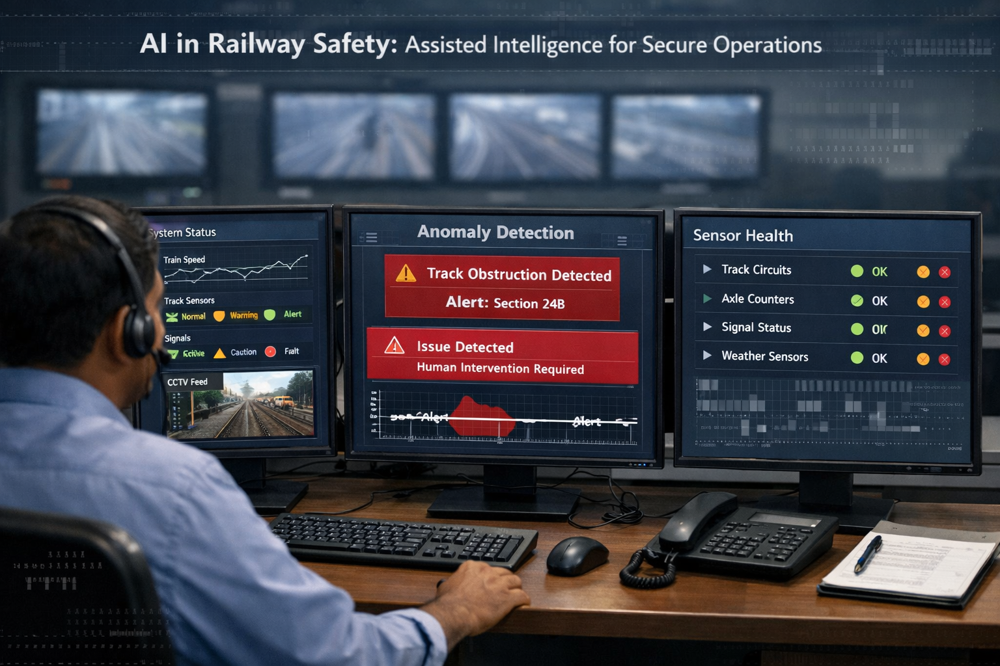
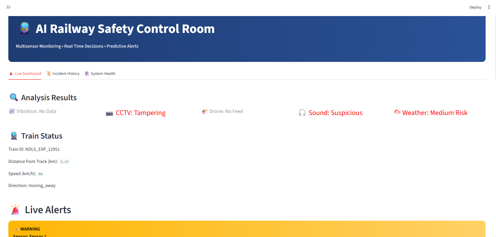
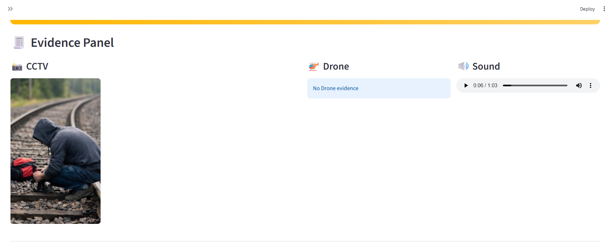
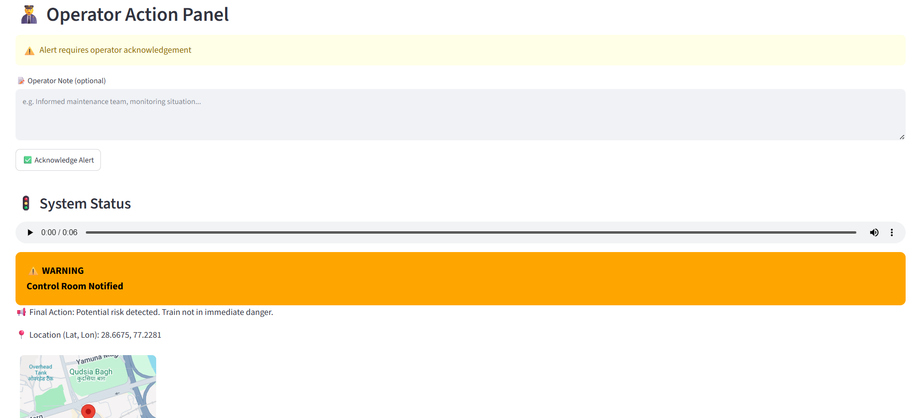

# Railway AI System (Version 1) 🚄

This is the initial prototype of the Railway AI Safety System, built rapidly using **Python and Streamlit**.

## Dashboard Preview

<div align="center">
  
  
  <br>
  
  
</div>

## Features
- **Real-Time Monitoring**: Simulate live monitoring of train tracks.
- **Multimodal AI Detection**: 
  - **Vision**: Analyzes CCTV feeds for track cracks, obstacles, or floods.
  - **Sound**: Detects abnormal acoustics (e.g., track cutting, grinding).
  - **Vibration**: Processes sensor data for anomalous shaking.
- **Automated Alerts**: Generates localized warnings when thresholds are exceeded.

## Running Locally

To launch this version on your machine:

```bash
cd railway_ai_system
pip install -r requirements.txt
streamlit run app.py
```
Then, open `http://localhost:8501` in your browser.